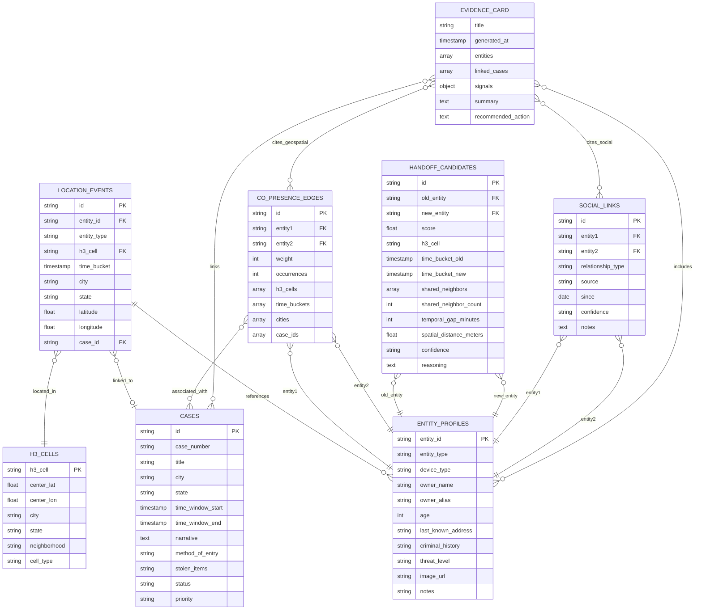
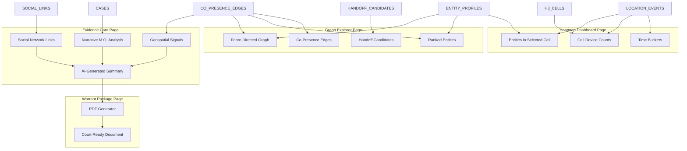

# Investigative Analytics Demo - Entity-Relationship Diagram

## Data Model Overview

This document describes the data entities and relationships displayed in the Investigative Analytics Demo application.

## Core Entities and Relationships



## Application Flow and Data Usage



## Key Entity Descriptions

### LOCATION_EVENTS

**Purpose**: Tracks device locations in 15-minute time buckets for geospatial analysis.

**Display**: Heatmap Dashboard

- Shows device density per H3 cell
- Filters by time bucket
- Highlights DC incident with 50 devices

**Key Fields**:

- `h3_cell`: H3 hexagonal grid cell identifier
- `time_bucket`: 15-minute time window (ISO 8601 format)
- `entity_id`: Device or person identifier

### ENTITY_PROFILES

**Purpose**: Stores suspect/device profile information for identification.

**Display**: All pages

- Profile cards with photos
- Threat level badges
- Criminal history

**Key Fields**:

- `owner_name`: Actual name of device owner
- `threat_level`: High, Medium, Low
- `image_url`: Avatar/photo path

### CO_PRESENCE_EDGES

**Purpose**: Precomputed co-location patterns between entities.

**Display**: Graph Explorer

- Force-directed graph visualization
- Edge thickness = weight
- Node size = score

**Key Fields**:

- `weight`: Strength of co-presence (1-10)
- `occurrences`: Number of times seen together
- `cities`: Cross-jurisdictional indicator

### CASES

**Purpose**: Burglary case records for M.O. matching.

**Display**: Evidence Card

- Case list with locations
- Narrative M.O. analysis
- Method of entry comparison

**Key Fields**:

- `method_of_entry`: "Rear window smash" (signature)
- `stolen_items`: Target preferences
- `narrative`: Case description

### HANDOFF_CANDIDATES

**Purpose**: Burner phone switch detection results.

**Display**: Graph Explorer (after "Detect Switch" button)

- Old device → New device visualization
- Confidence scoring
- Reasoning explanation

**Key Fields**:

- `score`: Detection confidence (0.0-1.0)
- `shared_neighbors`: Associates in common
- `temporal_gap_minutes`: Time between last/first appearance

### SOCIAL_LINKS

**Purpose**: Known associations between entities from intelligence sources.

**Display**: Evidence Card

- Social network evidence section
- Relationship types
- Source attribution

**Key Fields**:

- `relationship_type`: "Known Associates", "Connected To"
- `source`: Data provenance
- `confidence`: Reliability rating

### EVIDENCE_CARD

**Purpose**: AI-generated evidence summary for prosecution.

**Display**: Evidence Card Page & Warrant Package

- Structured evidence signals
- Geospatial + Narrative + Social
- Probable cause summary

**Key Structure**:

```json
{
  "signals": {
    "geospatial": [{"claim": "...", "support": [...], "confidence": "High"}],
    "narrative": [{"claim": "...", "support": [...], "confidence": "High"}],
    "social": [{"claim": "...", "support": [...], "confidence": "Medium"}]
  },
  "summary": "AI-generated probable cause narrative",
  "recommended_action": "Next steps for investigation"
}
```

## Demo Configuration

The `config` object defines the demo scenario parameters:

```json
{
  "dc_incident": {
    "case_id": "CASE_DC_003",
    "time_bucket": "2024-12-02T03:30:00.000Z",
    "h3_cell": "8a2a1072b59ffff",
    "expected_device_count": 50
  },
  "suspects": {
    "suspect1_old": "DEVICE_E0412",
    "suspect2": "DEVICE_E1098",
    "suspect1_new": "DEVICE_E2847"
  },
  "handoff": {
    "old_device": "DEVICE_E0412",
    "new_device": "DEVICE_E2847",
    "detection_id": "HANDOFF_001"
  }
}
```

## Data Generation

All data is generated deterministically with seed `42` in `backend/db/investigativeData.js`:

- **50 devices** in DC incident cell (noise)
- **2 suspects** recurring across **4 burglary scenes**
- **1 burner phone handoff** after DC crime
- **3 social links** between suspects and fence
- **5 cases** across DC, Nashville, and Baltimore

## API Endpoints

| Endpoint                                | Data Returned             | Used By           |
| --------------------------------------- | ------------------------- | ----------------- |
| `/api/investigative/cells`              | Device counts per H3 cell | Heatmap Dashboard |
| `/api/investigative/entities-in-cell`   | Entities at location/time | Heatmap Dashboard |
| `/api/investigative/co-presence`        | Co-presence edges         | Graph Explorer    |
| `/api/investigative/rank-entities`      | Ranked suspects           | Graph Explorer    |
| `/api/investigative/handoff-candidates` | Burner phone switches     | Graph Explorer    |
| `/api/investigative/evidence-card`      | AI evidence summary       | Evidence Card     |
| `/api/investigative/config`             | Demo configuration        | All pages         |
| `/api/investigative/time-buckets`       | Available time windows    | Heatmap Dashboard |

## User Flow (Happy Path - 90 seconds)

1. **Heatmap Dashboard** (15s)
   - View DC incident time bucket
   - Click hotspot cell with 50 devices
   - See top 2 suspects highlighted in red

2. **Graph Explorer** (30s)
   - Click "Explore in Graph View"
   - View co-presence network
   - Click "Collapse to Top 2 Suspects"
   - Click "Detect Burner Phone Switch"
   - See handoff detection

3. **Evidence Card** (25s)
   - Click "Generate Evidence Card"
   - Review 3 evidence types (Geospatial, Narrative, Social)
   - Read AI summary

4. **Warrant Package** (20s)
   - Click "Generate Warrant Package"
   - Review court-ready document
   - Click "Download Warrant Package (PDF)"
   - **Done: 90 seconds from map to warrant**

---

**Built for**: Cross-jurisdictional investigative analytics demo
**Target Audience**: Law enforcement analysts, prosecutors
**Key Insight**: "Right place, right time" → prioritized lead in under 90 seconds
