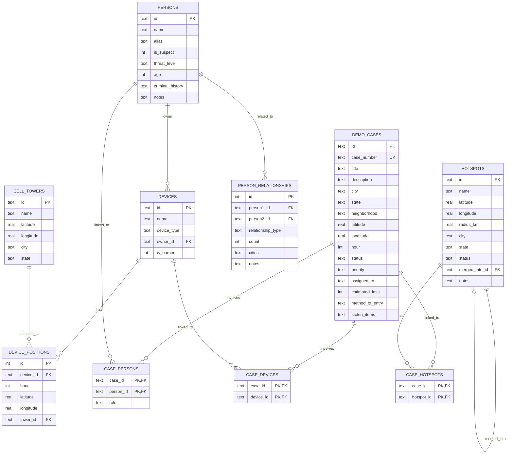

# Cross-Jurisdictional Investigative Analytics - Data Model

## Entity-Relationship Diagram

```
┌─────────────────────────────────────────────────────────────────────────────────────┐
│                                                                                     │
│  ┌─────────────────┐         ┌─────────────────┐         ┌─────────────────┐       │
│  │  CELL_TOWERS    │         │     PERSONS     │         │   DEMO_CASES    │       │
│  ├─────────────────┤         ├─────────────────┤         ├─────────────────┤       │
│  │ id (PK)         │         │ id (PK)         │         │ id (PK)         │       │
│  │ name            │         │ name            │         │ case_number     │       │
│  │ latitude        │         │ alias           │         │ title           │       │
│  │ longitude       │         │ is_suspect      │         │ description     │       │
│  │ city            │         │ threat_level    │         │ city, state     │       │
│  │ state           │         │ age             │         │ neighborhood    │       │
│  └────────┬────────┘         │ criminal_history│         │ lat, lng        │       │
│           │                  │ notes           │         │ hour            │       │
│           │                  └────────┬────────┘         │ status          │       │
│           │                           │                  │ priority        │       │
│           │                           │                  │ assigned_to     │       │
│           │                  ┌────────┴────────┐         │ estimated_loss  │       │
│           │                  │                 │         │ method_of_entry │       │
│           │                  │    DEVICES      │         │ stolen_items    │       │
│           │                  ├─────────────────┤         └────────┬────────┘       │
│           │                  │ id (PK)         │                  │                │
│           │                  │ name            │                  │                │
│           │                  │ device_type     │                  │                │
│           │                  │ owner_id (FK)───┼──────────────────┤                │
│           │                  │ is_burner       │                  │                │
│           │                  └────────┬────────┘                  │                │
│           │                           │                           │                │
│           │                           │                           │                │
│  ┌────────┴────────────────────┐      │      ┌────────────────────┴────────┐       │
│  │    DEVICE_POSITIONS         │      │      │      CASE_PERSONS           │       │
│  ├─────────────────────────────┤      │      ├─────────────────────────────┤       │
│  │ id (PK)                     │      │      │ case_id (PK, FK)            │       │
│  │ device_id (FK)──────────────┼──────┘      │ person_id (PK, FK)          │       │
│  │ hour                        │             │ role                        │       │
│  │ latitude                    │             └─────────────────────────────┘       │
│  │ longitude                   │                                                   │
│  │ tower_id (FK)───────────────┼─┐           ┌─────────────────────────────┐       │
│  └─────────────────────────────┘ │           │      CASE_DEVICES           │       │
│                                  │           ├─────────────────────────────┤       │
│                                  │           │ case_id (PK, FK)            │       │
│  ┌─────────────────────────────┐ │           │ device_id (PK, FK)          │       │
│  │   PERSON_RELATIONSHIPS      │ │           └─────────────────────────────┘       │
│  ├─────────────────────────────┤ │                                                 │
│  │ id (PK)                     │ │                                                 │
│  │ person1_id (FK)             │ │                                                 │
│  │ person2_id (FK)             │ │                                                 │
│  │ relationship_type           │ │                                                 │
│  │ count                       │ │                                                 │
│  │ cities                      │ │                                                 │
│  │ notes                       │ │                                                 │
│  └─────────────────────────────┘ │                                                 │
│                                  │                                                 │
└──────────────────────────────────┴─────────────────────────────────────────────────┘
```

## Mermaid ERD



## Tables Overview

### Core Entities

| Table         | Description                                          | Record Count |
| ------------- | ---------------------------------------------------- | ------------ |
| `cell_towers` | Cell tower locations across DC, Nashville, Baltimore | 8            |
| `persons`     | People (suspects + civilians)                        | 7            |
| `devices`     | Mobile phones linked to persons                      | 8            |
| `demo_cases`  | Burglary cases (key frames in timeline)              | 5            |

### Relationship Tables

| Table                  | Description                                       | Record Count |
| ---------------------- | ------------------------------------------------- | ------------ |
| `device_positions`     | Hourly device locations (72 hrs × ~7 devices)     | ~511         |
| `person_relationships` | CO_LOCATED, CONTACTED, KNOWN_ASSOCIATE            | 17           |
| `case_persons`         | Links persons to cases                            | ~10          |
| `case_devices`         | Links devices to cases                            | ~10          |
| `hotspots`             | Crime hotspot areas (initially 1-to-1 with cases) | 8            |
| `case_hotspots`        | Links cases to hotspots                           | 8            |

## Key Data

### Suspects

| ID            | Name            | Alias   | Threat Level |
| ------------- | --------------- | ------- | ------------ |
| person_marcus | Marcus Williams | "Ghost" | High         |
| person_darius | Darius Jackson  | "Slim"  | High         |

### Key Cases (Timeline)

| Hour | Case         | Location           | Priority     |
| ---- | ------------ | ------------------ | ------------ |
| 8    | DC-2024-1105 | Adams Morgan, DC   | Medium       |
| 15   | DC-2024-1107 | Dupont Circle, DC  | Medium       |
| 25   | DC-2024-1201 | Georgetown, DC     | **Critical** |
| 48   | TN-2024-1121 | East Nashville, TN | High         |
| 60   | TN-2024-1124 | The Gulch, TN      | High         |

### Relationship Types

- `CO_LOCATED` - Suspects present at same location (10 occurrences)
- `CONTACTED` - Phone contact between suspects (47 calls)
- `KNOWN_ASSOCIATE` - Prior criminal history together

## Data Flow

```
┌──────────────────────────────────────────────────────────────────┐
│                        Demo Timeline                              │
│                         (72 hours)                                │
├──────────────────────────────────────────────────────────────────┤
│                                                                   │
│  Hour 0-9     │ Adams Morgan (DC) - Initial surveillance         │
│  Hour 10-19   │ Dupont Circle (DC) - Pattern confirmed           │
│  Hour 20-29   │ Georgetown (DC) - PRIMARY INCIDENT (Hour 25)     │
│  Hour 30-39   │ Navy Yard (DC) - Laying low                      │
│  Hour 40-54   │ East Nashville (TN) - Cross-jurisdiction         │
│  Hour 55-71   │ The Gulch (TN) - Nashville operation             │
│               │                                                   │
│  Hour 65+     │ Baltimore - Burner phone detected                │
│                                                                   │
└──────────────────────────────────────────────────────────────────┘
```

## API Endpoints

| Endpoint                            | Description                      |
| ----------------------------------- | -------------------------------- |
| `GET /api/demo/config`              | Towers + key frames              |
| `GET /api/demo/positions/:hour`     | Device locations at hour         |
| `GET /api/demo/hotspots/:hour`      | Tower activity counts (dynamic)  |
| `GET /api/demo/cases`               | All cases with persons/devices   |
| `GET /api/demo/relationships`       | Person relationships for graph   |
| `GET /api/demo/graph-data`          | Network graph nodes/links        |
| `PATCH /api/demo/cases/:id/status`  | Update case status               |
| `POST /api/demo/cases/merge`        | Merge multiple cases             |
| `GET /api/demo/hotspots-entity`     | All hotspots (entity table)      |
| `GET /api/demo/hotspots-entity/:id` | Single hotspot with linked cases |
| `GET /api/demo/cases/:id/hotspot`   | Get hotspot linked to a case     |
| `POST /api/demo/hotspots/merge`     | Merge multiple hotspots          |
| `POST /api/demo/reset`              | Reseed database                  |
